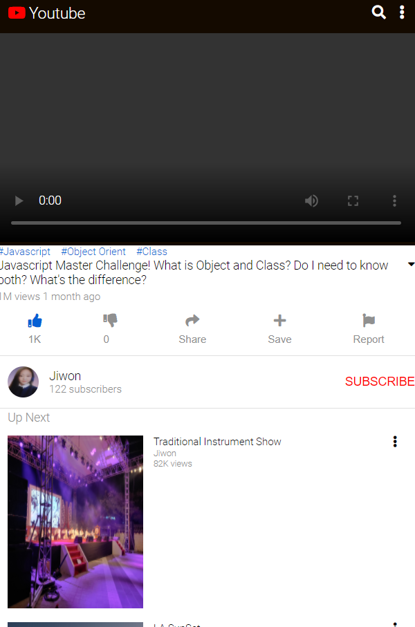

# Youtube Clone

#### By **Jiwon Han**

## Table of Contents

* Instructions
* Development
* Tech Stack
* Author
* License

## Instructions

A mock youtube web page. I focused on mimicking the Youtube using HTML and CSS.

<!-- ### To see Demo web app:

Currently, the app is deployed via Heroku. Visit https://my-daily-journal-jw.herokuapp.com/. -->

### To see the web page locally:

Clone the repository and open `index.html`.

## Development

### Part 1: Frontend 

#### HTML/CSS

* Markup  
  * Markup comprises a set of symbols, or a language, that can be used to provide instructions. The use of markup is supported by rules that define the symbols and how why shoul dbe used: a specification.  
  A webpage is created by marking-up content (text, images, etc) using the Hyper Text Markup Language(HTML).  
  The markup provides intructions to the software used for viewing a webpage(web browser) on how the page should look and work.  
  To create an HTML document, content is marked-up into information elements. Specific tags, denoted by characters within angle brackets, are used to signify the beginning, and end of each element. 
* Difference between CSS and LESS & SASS  
  * LESS and SASS are pre-processor for CSS code. They let you used variables and some logic in your style sheets. Since you can write actual code insdie of your style sheet, your sheets become dynamic which is incredibly useful for responsive design.  
  With CSS alone, you have to write out the styles you want exactly where you want them. Your CSS files will not update once they are loaded. 
  * Pre-processors  
  A pre-processor is just a program that writes CSS for you based on the code you write. By using a pre-processor, you are able to do things like use inheritance selectors and mix-ins. Those aren't options with regular CSS.  
  Pre-processors make it easier to read through your style sheets and figure out how everything is linked together. That makes it easier to maintain and update your styles without doing a lot of digging to find out why that image is three extra pixels to the right.  
  * LESS  
  LESS stands for Leaner Style Sheets. It's typically the choice for projects when you want to use Javascript with your style sheets. Using LESS isn't much different from writing regular CSS either. There are a few little add-ons that make it easier to handle you CSS, but they are fairly easy to pick up. 
  * SASS  
  SASS is basically the same as LESS except it's used in Rails applications. It stands for Synatactically Awesome Style Sheets. 

## Tech Stack

- HTML
- CSS

## Authors

#### Jiwon Han
* [GitHub](https://github.com/jiwon-seattle)
* [LinkedIn](https://www.linkedin.com/in/jiwon1han/)

## License

`YoutubeClone` is open source software.

(c) 2020 **_Jiwon Han_**
